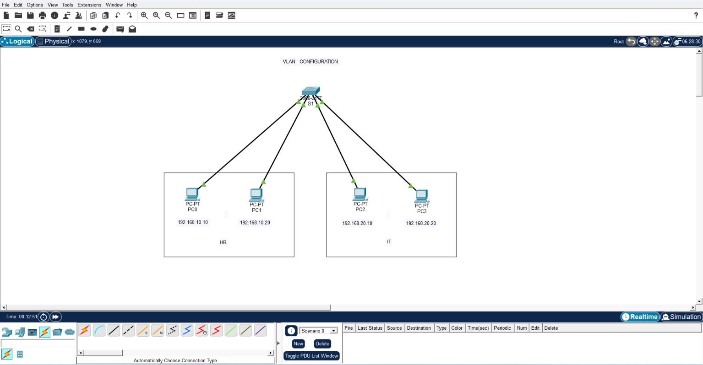

# CCNA VLAN Configuration Project

## Project Overview
This project demonstrates VLAN (Virtual Local Area Network) configuration on a Cisco switch using Cisco Packet Tracer. VLANs are used to logically divide a network into separate broadcast domains, improving network performance and security.

## Objectives
- Create VLANs on a Cisco switch
- Assign switch ports to specific VLANs
- Configure IP addresses on end devices
- Verify communication within the same VLAN
- Demonstrate VLAN isolation between different VLANs

## Network Topology



### VLAN Details

| VLAN ID | VLAN Name |
|----------|----------|
| 10 | HR |
| 20 | IT |

## Devices Used
- 1 Cisco Switch
- 4 PCs
- Cisco Packet Tracer

## IP Addressing Scheme

| Device | Department | IP Address |
|----------|----------|----------|
| PC1 | HR | 192.168.10.10 |
| PC2 | HR | 192.168.10.20 |
| PC3 | IT | 192.168.20.10 |
| PC4 | IT | 192.168.20.20 |

## Switch Port Assignment

| Port | VLAN |
|--------|--------|
| Fa0/1 | VLAN 10 |
| Fa0/2 | VLAN 10 |
| Fa0/3 | VLAN 20 |
| Fa0/4 | VLAN 20 |

## Configuration Steps

1. Create VLAN 10 (HR)
2. Create VLAN 20 (IT)
3. Assign switch ports to respective VLANs
4. Configure IP addresses on PCs
5. Verify VLAN configuration
6. Test connectivity using ping

## Switch Configuration

```bash
enable
configure terminal

vlan 10
name HR

vlan 20
name IT

interface range fa0/1-2
switchport mode access
switchport access vlan 10

interface range fa0/3-4
switchport mode access
switchport access vlan 20

end
write memory
```

## Verification

### Commands Used

```bash
show vlan brief
show running-config
```

### Test Results

✅ PC1 can communicate with PC2

✅ PC3 can communicate with PC4

❌ PC1 cannot communicate with PC3

❌ PC2 cannot communicate with PC4

This confirms that VLAN segmentation is working correctly.

## Skills Demonstrated

- VLAN Configuration
- Switch Port Assignment
- IP Addressing
- Network Segmentation
- Cisco Switch Management
- Network Troubleshooting
- Cisco Packet Tracer

## Project Files

- VLAN_Project.pkt
- Topology.png
- Switch_Config.txt
- README.md
